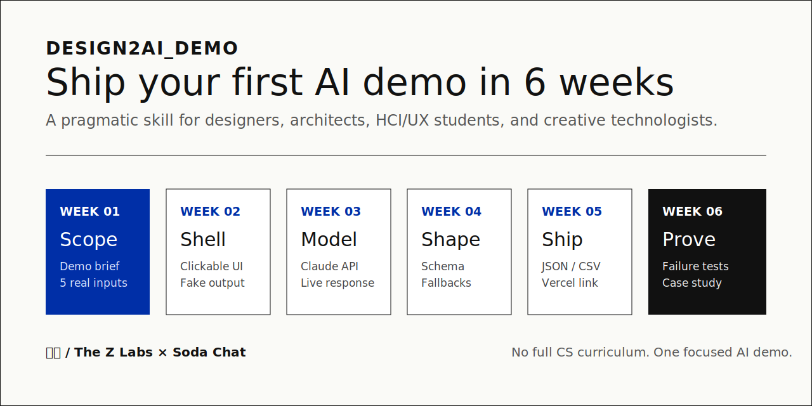

# design2ai_demo


**A six-week AI demo coach for designers who do not want to start with a full CS curriculum.**

`design2ai_demo` is a public Claude/Codex skill for designers, architects, HCI/UX students, and creative technologists who want to build their first portfolio-ready AI demo.

Created as a collaboration between **知城 / The Z Labs** and **Soda Chat**.



## 30-Second Start

Install the skill folder, then ask your agent:

```text
Use $design2ai-demo to create a personalized six-week plan for my first portfolio-ready AI demo. I studied architecture, know Figma and a little HTML/CSS, and can spend 6 hours per week.
```

The skill will turn your background, coding level, project idea, portfolio goal, and weekly time budget into one focused execution plan.

## What You Get

- One scoped AI demo concept, not a buffet of vague ideas
- A six-week build plan with weekly deliverables
- A conservative technical stack for a first demo
- Official learning resources mapped to each build step
- Testing tasks that include failures, not just happy paths
- A final portfolio package checklist

## Good For / Not For

| Good for | Not for |
|---|---|
| First AI portfolio demos | Full CS curriculum planning |
| Design-to-AI transition roadmaps | Machine learning research paths |
| HCI/UX application projects | Production SaaS architecture |
| Architecture or spatial-design AI concepts | Complex multi-agent systems |
| Design Engineer evidence-building | Career guarantees |

## How It Thinks

The core principle is simple:

> Do not learn the whole stack before starting. Learn the narrow stack needed to ship one real demo.

Default stack:

| Layer | Default choice | Why |
|---|---|---|
| Frontend | Next.js | Portfolio-ready web demo with server routes |
| AI app layer | Vercel AI SDK | Practical model integration for web apps |
| Model provider | Claude API | Strong default for critique, workflow, and synthesis demos |
| Alternative model | OpenAI API | Useful for structured outputs and existing OpenAI projects |
| Data | JSON/CSV first | Avoids premature database or RAG complexity |
| Deployment | Vercel | Turns a local prototype into a shareable link |
| Versioning | GitHub | Keeps the work reviewable and reusable |

## Six-Week Roadmap

| Week | Focus | Output |
|---|---|---|
| 1 | Scope the demo | One-page demo brief and 5 realistic inputs |
| 2 | Build the shell | Clickable frontend with fake AI output |
| 3 | Connect the model | One live Claude/OpenAI API call |
| 4 | Stabilize output | Structured schema and fallback states |
| 5 | Add real data and deploy | JSON/CSV source set and public Vercel link |
| 6 | Test and package | Failure tests, walkthrough, and case-study outline |

## Example Prompts

```text
Use $design2ai-demo to plan a six-week AI demo for an architecture student who wants to build around spatial design precedents.
```

```text
Use $design2ai-demo. I am a UX designer with interview notes from a class project. Help me turn them into a portfolio-ready AI workflow demo.
```

```text
Use $design2ai-demo to plan an HCI application project. I know React basics and want something more technical than a prompt wrapper.
```

## Installation

### Option 1: Copy the skill folder

Use the `design2ai-demo/` folder as the installable skill package.

For local Codex-style usage:

```bash
cp -R design2ai-demo ~/.codex/skills/
```

For Claude-style local usage:

```bash
cp -R design2ai-demo ~/.claude/skills/
```

### Option 2: Ask an agent to install it

Copy this into an AI agent with shell access:

```text
Install the design2ai_demo skill. Please copy the `design2ai-demo` folder into my local skills directory, verify that `SKILL.md`, `references/`, `examples/`, and `evals/` exist, then tell me how to invoke it with `$design2ai-demo`.
```

## Skill Name

The installable skill folder is `design2ai-demo` because skill metadata requires lowercase letters, digits, and hyphens. The public display name is `design2ai_demo`.

Invoke it as:

```text
Use $design2ai-demo to create a personalized six-week plan for my first portfolio-ready AI demo.
```

## Repository Structure

```text
.
  README.md
  .gitignore
  assets/
    roadmap-preview.svg
  design2ai-demo.zip
  design2ai-demo/
    SKILL.md
    agents/
      openai.yaml
    references/
      six-week-plan.md
      demo-types.md
      stack-decision-guide.md
      learning-resources.md
      testing-checklist.md
      portfolio-readiness.md
    examples/
      architecture-background.md
      ux-background.md
      hci-application.md
    evals/
      test-prompts.md
      release-check.md
```

## What The Skill Returns

- Assumptions and learner profile
- Recommended demo concept
- Technical stack and why it is enough
- Six-week table with weekly goals, learning resources, build tasks, deliverables, and done criteria
- What not to learn yet
- Final portfolio package checklist

## Validation

This skill has passed the official `quick_validate.py` structure check:

```text
Skill is valid!
```

The package includes `evals/test-prompts.md` for manual forward testing.

## Release Notes

- Public language: English
- Default audience: designers, architects, HCI/UX students, and creative technologists
- Default planning horizon: six weeks
- Default output: one portfolio-ready AI demo plan

## License

Add a license before final public release. MIT is a reasonable default if the goal is permissive reuse.
